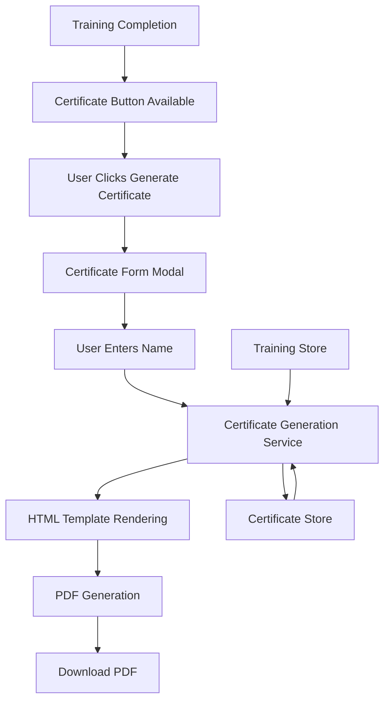

# Certificate Generation Feature Design

## Overview

The certificate generation feature will provide users with a professional PDF certificate upon completion of all FedRAMP training modules. The solution will integrate seamlessly with the existing React-based training system, leveraging the current Zustand state management and maintaining the established UI patterns.

The feature will use a client-side PDF generation approach to maintain the application's simplicity and avoid server dependencies. The certificate will be generated using HTML/CSS templates rendered to PDF format, ensuring consistent styling and professional appearance.

## Architecture

### High-Level Architecture



### Component Architecture

The feature will be implemented using a modular component architecture:

1. **CertificateButton** - Conditional button shown when training is complete
2. **CertificateModal** - Modal dialog for certificate generation form
3. **CertificatePreview** - Preview component showing certificate layout
4. **CertificateTemplate** - HTML template for PDF generation
5. **CertificateService** - Service layer for PDF generation logic

### State Management

A new Zustand store (`useCertificateStore`) will manage certificate-specific state:
- User name persistence
- Certificate generation history
- Certificate metadata (ID, generation dates)

## Components and Interfaces

### Core Components

#### CertificateButton Component
```typescript
interface CertificateButtonProps {
  onGenerateCertificate: () => void
  disabled?: boolean
}
```

**Responsibilities:**
- Display when all modules are completed (100% progress)
- Trigger certificate generation flow
- Show loading state during generation

#### CertificateModal Component
```typescript
interface CertificateModalProps {
  isOpen: boolean
  onClose: () => void
  onGenerate: (userData: CertificateUserData) => void
  existingUserData?: CertificateUserData
}

interface CertificateUserData {
  fullName: string
  email?: string
}
```

**Responsibilities:**
- Collect user information (name)
- Validate form inputs
- Show certificate preview
- Handle form submission

#### CertificateTemplate Component
```typescript
interface CertificateTemplateProps {
  userData: CertificateUserData
  completionData: CompletionData
  certificateId: string
  issueDate: Date
}

interface CompletionData {
  modules: ModuleCompletion[]
  overallCompletionDate: Date
  totalTimeSpent: number
  overallScore: number
}

interface ModuleCompletion {
  id: number
  title: string
  completionDate: Date
  score?: number
  timeSpent?: number
}
```

**Responsibilities:**
- Render professional certificate layout
- Include all required completion information
- Apply consistent styling and branding

### Service Layer

#### CertificateService
```typescript
interface CertificateService {
  generatePDF(templateElement: HTMLElement, filename: string): Promise<void>
  generateCertificateId(): string
  validateUserData(userData: CertificateUserData): ValidationResult
}

interface ValidationResult {
  isValid: boolean
  errors: string[]
}
```

**Responsibilities:**
- Generate unique certificate IDs
- Validate user input data
- Convert HTML template to PDF
- Handle file download

## Data Models

### Certificate Store State
```typescript
interface CertificateState {
  // User data
  savedUserData: CertificateUserData | null
  
  // Certificate history
  generatedCertificates: GeneratedCertificate[]
  
  // UI state
  isGenerating: boolean
  showModal: boolean
  
  // Actions
  saveUserData: (userData: CertificateUserData) => void
  addGeneratedCertificate: (certificate: GeneratedCertificate) => void
  setGenerating: (isGenerating: boolean) => void
  setShowModal: (show: boolean) => void
  clearData: () => void
}

interface GeneratedCertificate {
  id: string
  issueDate: Date
  userData: CertificateUserData
  completionSnapshot: CompletionData
}
```

### Integration with Training Store

The certificate feature will read from the existing training store:
- Module completion status
- Completion dates
- Quiz scores
- Time spent per module
- Overall progress

## Error Handling

### Validation Errors
- **Empty name field**: Display inline error message
- **Invalid characters**: Sanitize input and show warning
- **Name too long**: Enforce character limits with helpful feedback

### PDF Generation Errors
- **Browser compatibility**: Fallback messaging for unsupported browsers
- **Memory limitations**: Handle large certificate data gracefully
- **Download failures**: Retry mechanism with user feedback

### Network and Storage Errors
- **LocalStorage full**: Graceful degradation with session-only storage
- **State corruption**: Reset certificate data with user notification

## Testing Strategy

### Unit Tests
- **CertificateService**: PDF generation, ID generation, validation logic
- **Certificate Store**: State management, data persistence
- **Form validation**: Input sanitization and error handling
- **Template rendering**: Certificate content accuracy

### Integration Tests
- **Complete flow**: From button click to PDF download
- **State synchronization**: Training store integration
- **Modal interactions**: Form submission and cancellation
- **Error scenarios**: Network failures, validation errors

### Accessibility Tests
- **Keyboard navigation**: Modal and form accessibility
- **Screen reader compatibility**: ARIA labels and descriptions
- **Focus management**: Proper focus trapping in modal
- **Color contrast**: Certificate template readability

### Browser Compatibility Tests
- **PDF generation**: Cross-browser PDF library functionality
- **Download behavior**: File download across different browsers
- **LocalStorage**: State persistence compatibility

## Technical Implementation Details

### PDF Generation Library
**Recommended**: `jsPDF` with `html2canvas`
- **Pros**: Mature library, good HTML rendering, client-side only
- **Cons**: Bundle size increase (~200KB)
- **Alternative**: `react-pdf` for more control but higher complexity

### Certificate Template Styling
- Use CSS-in-JS or styled-components for precise PDF rendering
- Avoid complex CSS features that don't translate well to PDF
- Use web-safe fonts with fallbacks
- Implement print-friendly color schemes

### Security Considerations
- **Input sanitization**: Prevent XSS in user-provided names
- **Certificate ID generation**: Use `crypto.randomUUID()` (modern browsers) or `crypto.getRandomValues()` with base64 encoding for cryptographically secure random IDs
- **Data validation**: Server-side style validation even in client-only app
- **Content Security Policy**: Ensure PDF generation doesn't violate CSP

#### Certificate ID Generation Details
```typescript
// Modern approach using Web Crypto API
const generateCertificateId = (): string => {
  if (crypto.randomUUID) {
    // Use native UUID generation (supported in modern browsers)
    return crypto.randomUUID()
  } else {
    // Fallback using crypto.getRandomValues()
    const array = new Uint8Array(16)
    crypto.getRandomValues(array)
    return Array.from(array, byte => byte.toString(16).padStart(2, '0')).join('')
  }
}
```

This approach uses the browser's built-in Web Crypto API which provides cryptographically secure random number generation, eliminating the need for external libraries while maintaining security.

### Performance Optimization
- **Lazy loading**: Load PDF generation library only when needed
- **Template caching**: Cache rendered templates for regeneration
- **Bundle splitting**: Separate certificate code from main bundle
- **Memory management**: Clean up large objects after PDF generation

## Integration Points

### Training Store Integration
```typescript
// Read completion data from training store
const completionData = useTrainingStore((state) => ({
  modules: state.modules.filter(m => m.completed),
  overallProgress: state.overallProgress,
  completedCount: state.completedCount,
  // Calculate overall completion date from latest module completion
}))
```

### UI Integration Points
- **Main App**: Add certificate button to progress section
- **Theme integration**: Respect light/dark mode in certificate template
- **Responsive design**: Ensure modal works on mobile devices
- **Loading states**: Integrate with existing loading patterns

### File System Integration
- **Download handling**: Use browser's native download API
- **Filename generation**: Create descriptive, unique filenames
- **MIME type handling**: Proper PDF content type headers