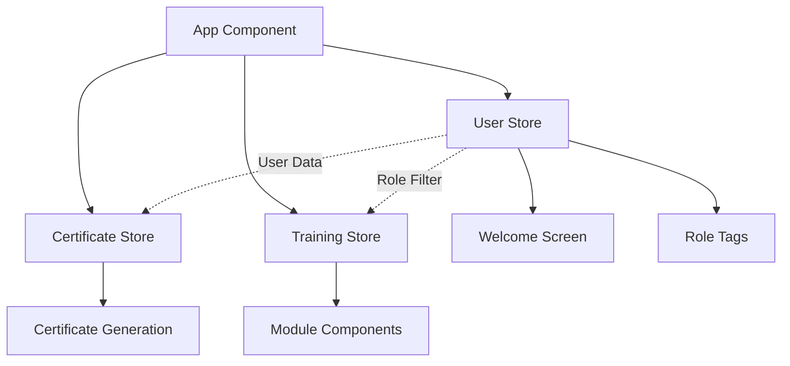

# Design Document

## Overview

This design implements a user onboarding flow that introduces role-based personalization to the FedRAMP Training LMS. The solution adds a welcome screen that collects user role (Development/Non-Development) and name information, then uses this data to personalize the training experience through role-specific content tags and pre-populated certificate generation.

The design integrates seamlessly with the existing Zustand-based state management architecture and maintains the current React component structure while adding new onboarding components and extending the training store.

## Architecture

### State Management Architecture

The design extends the existing Zustand store pattern by adding a new `userStore` that manages onboarding state alongside the existing `trainingStore` and `certificateStore`. This maintains separation of concerns while enabling cross-store data sharing.



### Component Hierarchy

The welcome screen introduces a new top-level routing pattern within the App component:

```
App
├── WelcomeScreen (new)
│   ├── RoleSelector (new)
│   ├── NameInput (new)
│   └── WelcomeContent (new)
├── MainDashboard (existing, modified)
│   ├── ModuleCard (existing, enhanced with role tags)
│   └── Progress Section (existing, simplified)
└── ModuleViewer (existing, enhanced with role tags)
```

### Data Flow

1. **Initial Load**: App checks user onboarding status from `userStore`
2. **Welcome Flow**: If not onboarded, show `WelcomeScreen` component
3. **Data Collection**: Collect role and name, persist to `userStore`
4. **Role-Based Display**: Use role data to filter/tag content in modules
5. **Certificate Integration**: Pass stored name to certificate generation

## Components and Interfaces

### New Components

#### WelcomeScreen Component
```typescript
interface WelcomeScreenProps {
  onComplete: (userData: UserOnboardingData) => void
}

interface UserOnboardingData {
  role: 'Development' | 'Non-Development'
  fullName: string
}
```

**Responsibilities:**
- Display welcome message and training overview
- Collect user role selection
- Collect user name with validation
- Handle form submission and validation
- Trigger onboarding completion

#### RoleSelector Component
```typescript
interface RoleSelectorProps {
  selectedRole: 'Development' | 'Non-Development' | null
  onRoleChange: (role: 'Development' | 'Non-Development') => void
  error?: string
}
```

**Responsibilities:**
- Render role selection buttons/cards
- Handle role selection state
- Display validation errors
- Provide accessible role selection interface

#### RoleTag Component
```typescript
interface RoleTagProps {
  roles: ('Development' | 'Non-Development')[]
  variant?: 'default' | 'compact'
  className?: string
}
```

**Responsibilities:**
- Display role-specific tags for content sections
- Support multiple roles per section
- Provide consistent visual styling
- Handle responsive display

### Enhanced Components

#### App Component (Modified)
- Add onboarding status check
- Implement conditional rendering (WelcomeScreen vs MainDashboard)
- Remove "About this Training" section
- Integrate with new `userStore`

#### ModuleCard Component (Enhanced)
- Display role tags for each module
- Filter content based on user role (future enhancement)

#### ModuleViewer Component (Enhanced)
- Add role tags to content sections
- Highlight role-relevant content

### Store Interfaces

#### User Store
```typescript
interface UserState {
  // User data
  isOnboarded: boolean
  role: 'Development' | 'Non-Development' | null
  fullName: string | null
  onboardingCompletedAt: Date | null
  
  // Actions
  completeOnboarding: (userData: UserOnboardingData) => void
  updateRole: (role: 'Development' | 'Non-Development') => void
  updateName: (name: string) => void
  resetOnboarding: () => void
  
  // Getters
  getUserData: () => UserOnboardingData | null
  isRoleRelevant: (contentRoles: string[]) => boolean
}
```

#### Module Content Enhancement
```typescript
interface ModuleContent {
  type: string
  title: string
  content: string
  roles?: ('Development' | 'Non-Development')[] // New field
}
```

## Data Models

### User Onboarding Data
```typescript
interface UserOnboardingData {
  role: 'Development' | 'Non-Development'
  fullName: string
}

interface UserProfile {
  isOnboarded: boolean
  role: 'Development' | 'Non-Development' | null
  fullName: string | null
  onboardingCompletedAt: Date | null
}
```

### Module Role Configuration
```typescript
interface RoleConfiguration {
  moduleId: number
  sections: {
    sectionIndex: number
    applicableRoles: ('Development' | 'Non-Development')[]
  }[]
}
```

### Enhanced Certificate Integration
The existing certificate store will be enhanced to automatically use the stored user name:

```typescript
// Enhanced certificate user data interface
interface CertificateUserData {
  fullName: string
  role?: 'Development' | 'Non-Development' // Optional role info for certificate
}
```

## Error Handling

### Validation Errors
- **Empty Name**: Display inline error message below name input
- **No Role Selected**: Display error message near role selector
- **Form Submission**: Prevent submission until all fields are valid

### State Recovery
- **Corrupted User Data**: Reset onboarding state and show welcome screen
- **Missing Role Data**: Gracefully handle missing role tags in content
- **Store Persistence Failure**: Continue with in-memory state, show warning

### Fallback Behavior
- **Role Tags Missing**: Display content without role filtering
- **User Store Unavailable**: Skip onboarding, use existing flow
- **Certificate Integration**: Fall back to manual name entry if stored name unavailable

## Testing Strategy

### Unit Testing
- **User Store**: Test all actions, state transitions, and persistence
- **WelcomeScreen**: Test form validation, submission, and error states
- **RoleSelector**: Test role selection and validation
- **RoleTag**: Test rendering with different role combinations

### Integration Testing
- **Onboarding Flow**: Test complete welcome screen to main dashboard flow
- **Certificate Integration**: Test automatic name population from user store
- **Role-Based Display**: Test role tag display in modules
- **State Persistence**: Test localStorage persistence across browser sessions

### Component Testing
- **Welcome Screen Rendering**: Test initial state, form interactions, validation
- **Role Tag Display**: Test role tag rendering in different contexts
- **App Routing**: Test conditional rendering based on onboarding status

### Accessibility Testing
- **Keyboard Navigation**: Ensure all interactive elements are keyboard accessible
- **Screen Reader Support**: Test ARIA labels and semantic HTML
- **Focus Management**: Test focus flow through welcome screen form
- **Color Contrast**: Ensure role tags meet WCAG contrast requirements

### User Experience Testing
- **Form Validation**: Test real-time validation feedback
- **Error Recovery**: Test error state handling and recovery
- **Mobile Responsiveness**: Test welcome screen on mobile devices
- **Performance**: Test impact on initial load time

## Implementation Considerations

### Backward Compatibility
- Existing users without onboarding data should see welcome screen on next visit
- Existing certificate generation should continue working during transition
- Module content without role tags should display normally

### Performance Optimization
- Lazy load welcome screen components to minimize initial bundle size
- Use React.memo for role tag components to prevent unnecessary re-renders
- Implement efficient role filtering for large module content

### Accessibility Requirements
- Welcome screen must be fully keyboard navigable
- Role selection must have proper ARIA labels
- Form validation errors must be announced to screen readers
- Role tags must have sufficient color contrast

### Mobile Responsiveness
- Welcome screen must work on mobile devices
- Role selector must be touch-friendly
- Role tags must be readable on small screens
- Form inputs must be appropriately sized for mobile

### Data Privacy
- User data stored only in localStorage (no external transmission)
- Role information used only for content personalization
- Name data used only for certificate generation
- Clear data retention and deletion policies